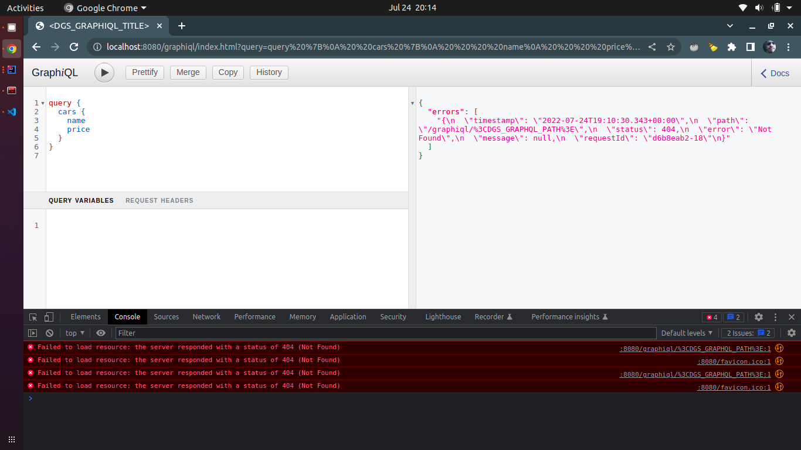

# dgs-issue-1135

## Prerequisities

| Name    | Required |
|---------|----------|
| Java 17 | true     |


## Step by step to reproduce the issue
1. Clone this repo
```
git clone https://github.com/ClaudenirFreitas/dgs-issue-1135.git
```
2. Run the application: 
```
./gradlew clean bootRun
```
3. Open the GraphiQL page: 
```
http://localhost:8080/graphiql
```
4. Execute this query:
```
query {
  cars {
    name
    price
  }
}
```
As you can see, when we are typing the query, we are adding some query parameters in the URL. In that case, the URL will be: `http://localhost:8080/graphiql/index.html?query=query%20%7B%0A%20%20cars%20%7B%0A%20%20%20%20name%0A%20%20%20%20price%0A%20%20%7D%0A%7D%0A`.  

5. Rerun the application (step 2)  
6. Reload the GraphiQL page (step 4). You will see the error message:

